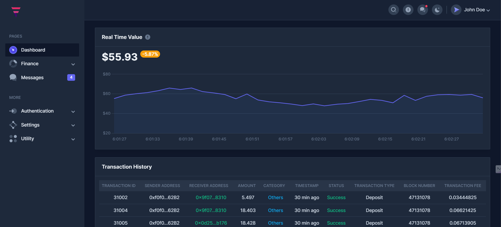

# FiNexus - Distributed Ledger System

## Overview
The Distributed Ledger System is a decentralized application (DApp) that allows users to manage transactions, create smart contracts, and securely store data using blockchain technology. This project includes a website and an Android app for accessing and interacting with the system.

## Features
- **Transaction Management**: Users can create, view, and manage transactions securely using blockchain technology.
- **Smart Contracts**: The system provides a provision for users to create and deploy smart contracts for various purposes.
- **Security**: Blockchain technology is used to ensure the security and integrity of transactions and data.
- **Cross-Platform**: The system is accessible via both a web interface and an Android app, providing flexibility and convenience to users.

## Technologies Used
- **Frontend**: React for the website and Android for the mobile app.
- **Backend**: Firebase is used for authentication and database services.
- **Blockchain**: The system incorporates blockchain technology for security and transaction handling.

## Installation
1. Clone the repository: `git clone https://github.com/your/repository.git`
2. Install dependencies: `npm install`
3. Start the development server: `npm run dev`

## Usage
1. Register or login to the system using your credentials.
2. Navigate to the transaction management section to create, view, or manage transactions.
3. Use the smart contract section to create and deploy smart contracts for various purposes.

## Overview

## Contributing
We welcome contributions from the community. If you have any ideas, bug fixes, or improvements, please submit a pull request.

## License
This project is licensed under the MIT License. See the LICENSE file for details.

## Contact
For any questions or feedback, please contact Parth Khairnar at pskhairnar1024@gmail.com.
